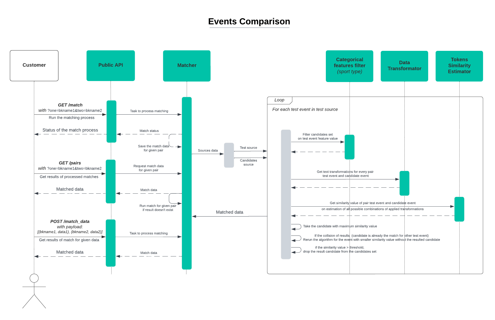

## Events Comparison
Input message new format
```json
{
    "bk1":{
        "bkname": str,
        "data": []
    },
    "bk2":{
        "bkname": str,
        "data": []
    },
    "post_host": str, 
    "get_host": str, 
    "parameters":{
        "MINIMAL_SIM_THRESHOLD": float,
        "REMOVE_CANDIDATE_THRESHOLD": float,
        "FINAL_SIM_RATIO": float,
        "types": {
            "american-football": {
                "MINIMAL_SIM_THRESHOLD": float,
                "REMOVE_CANDIDATE_THRESHOLD": float,
                "FINAL_SIM_RATIO": float,
            },
            "some_type":{
                "MINIMAL_SIM_THRESHOLD": float,
                "REMOVE_CANDIDATE_THRESHOLD": float,
                "FINAL_SIM_RATIO": float,
            },
        }
    }
}
```

Output message format:
1. `/get_hook` with params:
```json
{
    "status": str,
    "time_minutes": float,
    "bk1": str,
    "bk2": str
}
```
2. `/post_hook`:
```json
{
    "status": str,
    "time_minutes": float,
    "result": {
      "job_id": int,
      'result': [{
                  'bk1': {...}, 
                  'bk2': {...},
                  'score': {
                            'final_similarity': float, 
                            'league_similarity': float,
                            'teams_similarity': float
                           } 
                  }, ...]
    }
            
}
```

### 1. General logic


### 2. Run the service
The service can be launched in 2 ways:
1. Locally by starting FastAPI app via uvicorn: ```uvicorn main:app``` 

_(inside the pipenv shell with installed requirements from Pipfile)_

2. Inside the Docker container:Docker build:
    
Docker build:
```docker build -t matcher  . ```

Docker run: ```docker run  --env-file .env -d --rm -p 8000:80 matcher ```
<hr>

The Swagger endpoints description can be found on the endpoint ```/docs```

### 3. Files and parameters description
#### Files:
```main.py``` - The API app with endpoints.

```matcher.py``` - Combined logic of match process.

```transform.py``` - Implementation of text transformations.

```measure.py``` - Implementation of text-similarity metrics.

```loader.py``` - Data loading and result formatting implementation.

```utils.py``` - Auxiliary stuff.

#### Parameters:
```config.yaml``` - Links to the data sources.

Hyper-parameters in ```.env``` file:

```MINIMAL_SIM_THRESHOLD``` - Minimal similarity value to consider 
the candidate event as a match for some test event. Required for avoiding 
false-positive matches.

```REMOVE_CANDIDATE_THRESHOLD``` - Confidence value that identifies 
that the founded match pair is ensured, and we can drop the candidate 
from the candidates set.

```FINAL_SIM_RATIO``` - Impact of the event name tokens similarity and event league similarity, so that 

the formula is: ```result_similarity = FINAL_SIM_RATIO * events_name_sim + (1-FINAL_SIM_RATIO) * events_league_sim ```
